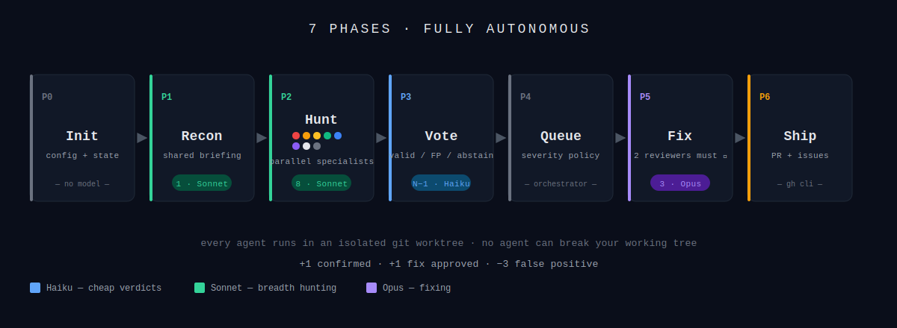

# bounty

A Claude Code plugin that turns a crew of agents loose on your codebase to bring back bugs. Eight specialists sail out under their own flag, each hunting through a different lens, then argue over each other's hauls. Real finds pay out. Shallow claims cost three. Whatever survives the shouting gets patched up and shipped as a single PR.

For fixing a *known* bug, use [`zap`](https://github.com/obra/zap) - `bounty` is for the ones you haven't spotted yet.

## How It Works



**7 phases, fully autonomous:**

| Phase | What happens | Agents | Model |
|-------|--------------|--------|-------|
| **P0 Init** | Hoist the flag, seed `.temp/bounty/` state | - | - |
| **P1 Recon** | A scout surveys scope, churn, and test gaps - the map everyone sails from | 1 | Sonnet |
| **P2 Hunt** | 8 specialists fan out in parallel, each writing claims to JSON | 8 | Sonnet |
| **P3 Vote** | For each claim, the other 7 call VALID / FALSE_POSITIVE / ABSTAIN | N−1 per claim | Haiku |
| **P4 Queue** | Confirmed finds queued, severity-policed (criticals → GitHub issue, rest → auto-fix) | - | - |
| **P5 Fix** | Top 3 fixes implemented in parallel; 2 reviewers must approve each | up to 3 | Opus |
| **P6 Ship** | Approved fixes cherry-picked onto one branch → PR via `gh` | - | - |

Every agent runs in its own git worktree. Claims, votes, and fixes are all JSON on disk - the run is resumable and the leaderboard is real.

## Usage

```
/bounty [--scope <path>] [--agents N] [--severity low|medium|high|critical] [--max-claims N] [--no-fix]
```

Options:

| Flag | Effect |
|------|--------|
| `--scope <path>` | Where to hunt (default: repo root). X marks the spot. |
| `--agents N` | Crew size, 3-12 (default: 8) |
| `--severity <floor>` | Throw back anything below this (default: `medium`) |
| `--max-claims N` | Hold size - cap on total claims (default: 40) |
| `--no-fix` | Report-only run. Scout, don't skirmish. |
| `--model-hunt <tier>` | Override hunter model (default: `sonnet`) |
| `--model-fix <tier>` | Override fixer model (default: `opus`) |

Examples:

```
/bounty --scope src/blackpearl

/bounty --severity high --max-claims 10

/bounty --scope src/payments --agents 5 --no-fix

/bounty --scope . --severity medium   # full-repo weekend run
```

Or just ask in plain English:

> Use the /bounty skill on the BlackPearl app

Claude will figure out the scope and kick off the hunt.

## What Makes It Different

**Specialists, not clones.** Each hunter sails under one of eight flags - security, concurrency, performance, null-safety, error handling, authz, data integrity, resource management. Any hunter can claim any bug, but the flag gives them a starting heading so eight of them don't all come back with the same top-of-file smell.

**Shallow claims cost you.** +1 for a confirmed bug. **−3** when the majority calls your claim bogus. The penalty is deliberately harsh: submitting junk should hurt more than finding real treasure rewards. Quality over quantity, enforced by the accountant.

**Cheap where it should be.** Voting is a yes-or-no verdict - runs on Haiku, pennies per call. Hunting runs on Sonnet. Only the actual code-writing hits Opus. A full 8-agent run costs roughly a quarter of the naive "everything on one model" approach.

**Nobody stomps anybody.** Every hunter and fixer works in its own isolated git worktree. Builds, tests, and diagnostic logging run in parallel without tripping over each other.

**No duplicate bounties.** Two hunters find the same bug at the same file:line-bucket? First to file gets credit, the second gets "co-discovery" attribution. Same scoring rules, no duplicate fixes, no squabbling in the bilge.

**Resumable by design.** Every claim, vote, and fix lives as a JSON file under `.temp/bounty/`. Kill the run halfway through, come back, keep going. Audit the whole voyage afterwards.

**Ships real PRs.** Approved fixes get cherry-picked onto one branch and opened as a single PR against main. Criticals become GitHub issues (some calls still belong to the captain). Commits follow your project's conventions - no AI attribution, no `fix:` prefixes.

## Install

```
/plugin marketplace add https://github.com/moogento/bounty.git
/plugin install bounty@bounty
```

Restart Claude Code. `/bounty` and `/bounty-cleanup` are available in every project.

Developing locally? Clone the repo and run `/plugin marketplace add <path-to-clone>` from the project root instead.

## What Winning Looks Like

At the end of a run, `bounty` prints the leaderboard to stdout and mirrors it to `.temp/bounty/README.md`. Here's a sample from a real-sized module:

```
🏆 BOUNTY LEADERBOARD  -  BlackPearl
─────────────────────────────────────────────────────────────────
  #    Specialist          Found  Conf  FPs  Fixes   Score
─────────────────────────────────────────────────────────────────
 🥇    Concurrency            4     4    0     2      +6
 🥈    Security               6     5    1     1      +3
 🥉    Performance            3     3    0     0      +3
  4    DataIntegrity          2     2    0     0      +2
  5    NullSafety             3     2    0     0      +2
  6    ErrorHandling          2     1    0     0      +1
  7    Resources              1     0    0     0       0
  8    AuthZ                  4     1    2     0      -5  💀
─────────────────────────────────────────────────────────────────
 Confirmed 18  ·  FPs 3  ·  Inconclusive 4  ·  Fixed 3  ·  Critical 1
```

Reading left to right: Concurrency found 4 bugs, all confirmed, fixed 2 of them, and took the crown. Security was prolific but one of its claims got voted down by the majority - hence the -3 penalty dragging its total. AuthZ had a rough day: 4 claims, only 1 confirmed, two called bogus, -5 and a skull. That is the accountant doing their job.

The numbers aren't vanity. Every row is derived from JSON files on disk (`.temp/bounty/leaderboard.json`) so you can audit every claim, every vote, and every fix after the fact.

## When to Use It

- You've shipped a module and want a pre-release sweep before it touches production
- You're inheriting a codebase and need to know where the skeletons are buried
- You want a quality/security pass without committing to a full manual review
- Quarterly "what have we been ignoring" voyage through a stable module

## When Not to Use It

- You already know where the bug is - use `zap` or fix it yourself
- The codebase is ~100 LOC - just read it
- You need deterministic static analysis - phpstan/psalm/phpcs already do that
- You want cheap - a full run spawns ~40 agents. This is not pocket change.

## Cost

A default run (8 agents, 40-claim cap, fixing on):

| Phase | Spawns | Model | Rough share |
|-------|--------|-------|-------------|
| Recon | 1 | Sonnet | small |
| Hunt | 8 parallel | Sonnet | medium |
| Vote | up to 280 calls | Haiku | small (cheap per call) |
| Fix | up to 10 | Opus | **largest** |
| Review | up to 20 | Sonnet | medium |

`--no-fix` keeps everything in the Sonnet/Haiku tier for report-only runs.

Use it for modules that justify the investment. For one-off questions, ask directly.

## Cleanup

```
/bounty-cleanup [--keep-state]
```

Removes worktrees, deletes merged `bounty/*` branches, clears `.temp/bounty/`. Pass `--keep-state` to preserve the audit trail.

## Requirements

- Claude Code CLI with Task tool + `isolation: "worktree"` support
- Git repository (worktrees require it)
- `gh` CLI for PR and issue creation
- `jq` recommended for state inspection (not required for running)

## Files

```
bounty/
├── .claude-plugin/
│   ├── plugin.json
│   └── marketplace.json
├── assets/
│   ├── banner.svg
│   └── flow.svg
├── commands/
│   ├── bounty.md
│   └── bounty-cleanup.md
├── skills/bounty/
│   ├── SKILL.md
│   └── references/
│       ├── agent-specialties.md
│       ├── scoring-rules.md
│       └── state-schema.md
└── README.md
```

## License

MIT
